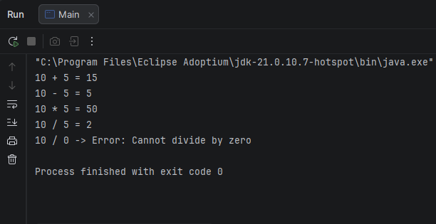
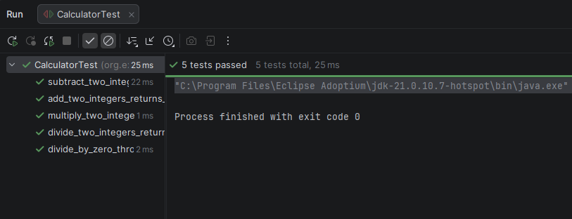

# Calculator TDD Java

A simple calculator implemented in Java using Test Driven Development (TDD).  
The project includes unit tests and demonstrates basic arithmetic operations.

## Technologies

- Java
- Maven
- JUnit

## Operations

- Addition
- Subtraction
- Multiplication
- Division
- Division by zero handling

## Project Structure

```text
src/
|-- main/java/org/example/
|   |-- Calculator.java
|   `-- Main.java
|-- test/java/org/example/
|   `-- CalculatorTest.java
docs/images/
|-- calculatorTest.png
`-- main.png
```

## Running the application

Run the program from the `Main` class.

## Tests

The project includes unit tests that verify the behavior of the calculator operations.

### Tests passing



### Application output


